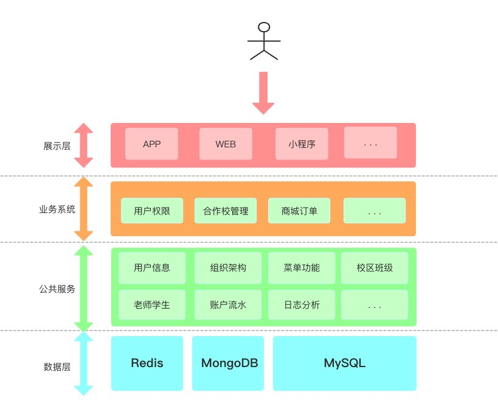

# operation


## 前言

　　`operation`项目是原运营平台前后端分离后使用新框架的后台项目，包含用户权限管理、合作校信息管理、商城订单等。

## 项目介绍

　　基于SpringBoot2.0.1.RELEASE的分布式系统架构。

### 组织结构

``` lua
operation
├── operation-common -- 框架公共模块
|    ├── operation-common-base -- 公共模块基础：常量、实体类、工具类
|    ├── operation-common-encryption -- 加解密
|    ├── operation-common-redis -- redis：redis 方法封装、分布式锁
|    ├── operation-common-repository  -- 持久层处理
|    ├── operation-common-web  -- web层处理：controller base 实现，日志切面、请求身份认证、访问请求限制、统一异常处理
├── operation-upms -- 用户权限管理系统
|    ├── operation-upms-common -- upms系统公共模块
|    ├── operation-upms-core-api -- upms系统api
|    ├── operation-upms-core-provider -- upms系统生产者[端口:9071]
|    ├── operation-upms-rest-api -- upms系统rest api[端口:8071]
└── operation-sms -- 学校管理系统
     ├── operation-sms-common -- sms系统公共模块
     ├── operation-sms-core-api -- sms系统api
     ├── operation-sms-core-provider -- sms系统生产者[端口:9072]
     └── operation-sms-rest-api -- sms系统rest api[端口:8072]
```

### 技术选型

#### 后端技术:
技术 | 名称 | 官网
----|------|----
springboot2 | 容器、MVC 框架  | [http://projects.spring.io/spring-framework/](http://projects.spring.io/spring-framework/)
JWT | 身份校验  | [https://jwt.io/](https://jwt.io/)
MyBatis | ORM框架  | [http://www.mybatis.org/mybatis-3/zh/index.html](http://www.mybatis.org/mybatis-3/zh/index.html)
MyBatis Generator | 代码生成  | [http://www.mybatis.org/generator/index.html](http://www.mybatis.org/generator/index.html)
PageHelper | MyBatis物理分页插件  | [http://git.oschina.net/free/Mybatis_PageHelper](http://git.oschina.net/free/Mybatis_PageHelper)
Druid | 数据库连接池  | [https://github.com/alibaba/druid](https://github.com/alibaba/druid)
Redis | 分布式缓存数据库  | [https://redis.io/](https://redis.io/)
Log4J | 日志组件  | [http://logging.apache.org/log4j/1.2/](http://logging.apache.org/log4j/1.2/)
Swagger2 | 接口测试框架  | [http://swagger.io/](http://swagger.io/)
Jenkins | 持续集成工具  | [https://jenkins.io/index.html](https://jenkins.io/index.html)
Maven | 项目构建管理  | [http://maven.apache.org/](http://maven.apache.org/)


#### 架构图



#### 模块依赖


#### 开发工具:
- MySql: 数据库
- Git: 版本管理
- IntelliJ IDEA: 开发IDE，需要安装`lombok插件`
- Navicat for MySQL: 数据库客户端

#### 开发环境：
- Jdk8
- Redis
- Zookeeper


### 数据模型


### 编译流程

maven编译安装operation/pom.xml文件即可

### 启动顺序（后台）

> 准备工作

- 启动本地Zookeeper


> **operation-upms**

- 配置Apollo连接：在对应应用的VM options 中配置-Dapp.id=operation-upms-core-provider -Denv=dev -Ddev_meta=http://192.168.0.200:18081和-Dapp.id=operation-upms-rest-api -Denv=dev -Ddev_meta=http://192.168.0.200:18081

- 启动UpmsCoreProviderApplication => UpmsRestApiApplication

> **operation-sms**

- 启动SmsCoreProviderApplication => SmsRestApiApplication


### 框架规范约定

约定优于配置(convention over configuration)，此框架约定了一些编程规范，下面一一列举：

```
1. 类名：首字母大写驼峰规则；方法名：首字母小写驼峰规则；常量：全大写；变量：首字母小写驼峰规则，尽量非缩写
2. 模块命名为`项目`-`子项目`-`业务`，如`operation-sms-core-api`
3. DO：`operation-sms-core-api`包下的 entity 表示持久层实体类，以`DO`结尾。必须和 MySQL 或者 MongoDB 中的 table 一一对应，不允许存在业务逻辑，统一由代码生成插件生成，放在对应的子系统包名下，如`sms`，一般情况下实体类名称可以不带子系统名称。如表名为`upms_user`实体类名为`user`即可
4. DTO：controller 和 service 以及 service 和 dao 层之间基础 CRUD 可以直接使用 entity，复杂查询请在对应模块下`common`模块中创建 DTO 类，以`DTO`结尾，DTO 中可以直接引用 entity，
5. param：controller 层接收的参数必须在对应的 param 中，以`param`结尾。同一个业务下 param 可以复用，比如用户相关参数接收可以统一使用`UserParam`每一个需要返回业务数据的接口都需要一个对应的 VO，VO 放在 rest-api 模块中，不能被其他模块使用。
6. VO：controller 层返回的数据必须在对应的 VO 中，以`VO`结尾。每一个需要返回业务数据的接口都需要一个对应的 VO，本着消费者需要什么参数就返回什么参数的原则来设计 VO 类。VO 放在 rest-api 模块中，不能被其他模块使用。
7. 使用`lombok`，需要在 idea 中安装 lombok 插件，去除项目中所有 getter、setter、tostring 等。
8. 接口指定请求类型，目前统一使用`@PostMapping`
9. 新增、修改数据时，需要使用`@Valid`对数据进行校验
10. 接口返回值统一放在 map 中返回，不要直接返回
11. 不要使用 map 或者 json 作为参数在方法中传递

- 更多规范，参考阿里巴巴Java开发手册
```

### DB规范约定

```
1. 数据表命名为：`子系统`_`表`，如`upms_user`
2. 命名使用全小写
3. 枚举对应默认使用 char(1)
4. 所有表都包含id、create_id、create_date、update_id、update_date、remarks
5. 无特殊情况下，每个字段都设定为 not null
6. 表示是否的字段使用`xxx_flag`表示，默认为 0-否，1-是
7. remarks 内部使用，不用于其他业务场景

```

### 如何从头到尾编写一个接口

1. 给对应的 table 生成实体类以及基础增删查改
     * 在 generatorConfig.xml 中配置好需要生成的表。
          
     * 在 maven 插件中执行，在执行前请删除或者注释之前的配置。
          
     * 生成的实体类请移动到 common 包对应的模块下。
2. controller 层编码
     * 在对应包下创建对应业务实体的接口类
          
     * 编写接口代码
          
     * 对数据库有写入操作的接口请使用`@Valid`以及`BindingResult`校验参数格式，并使用`@WriteLock`来避免重复写入。
     * 执行业务逻辑之前对参数进行对应的校验。
     * 如果有引用其他业务数据，请先校验数据是否存在，避免出现 NPE。
3. service 层编码
     * 在对应目录下创建 interface
          
     * 在方法声明时填写完整的方法注释
          
     * 方法实现中不需要添加方法注释
          
     * 如果是方法内部实现，则需要添加对应注释
          
4. 持久层编码
     * 在 mapper 中声明方法，不要使用 map 传递参数，请指定参数，或直接使用 DO 对象。
          


### 小技巧
```
1. IDEA提交代码时，勾选Reformat code、Rearrange code、Optimize imports, 让代码更整洁

```


### 常见问题

- 目前还没有整理
